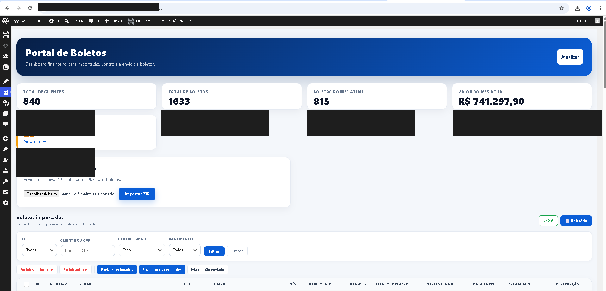
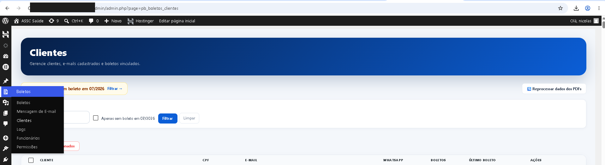
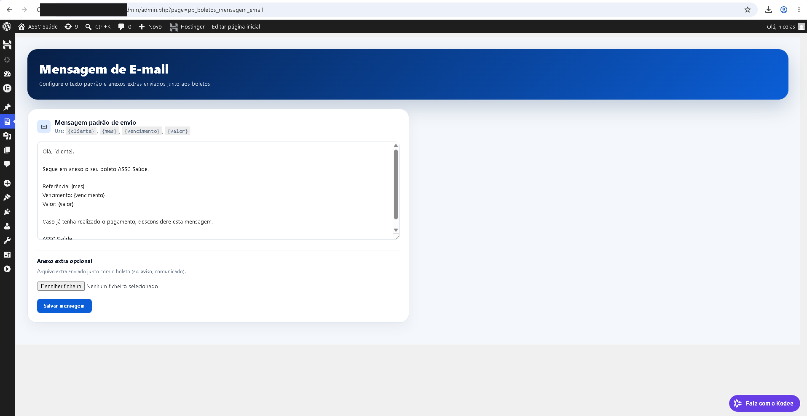

# 🧾 Portal de Boletos — Plugin WordPress

Plugin WordPress customizado para **gestão e consulta de boletos por CPF**, desenvolvido sob encomenda para uma clínica de saúde de médio porte (centenas de clientes ativos, centenas de boletos processados por mês).

<p align="center">
  
</p>

---

## 💡 O problema

A clínica enviava boletos manualmente, um por um, todo mês — sem controlo centralizado de quem já tinha pago, quem já tinha recebido o boleto, ou histórico de alterações. Qualquer dúvida de um cliente ("já enviaram o meu boleto?", "já registaram o meu pagamento?") exigia procurar em planilhas e emails avulsos.

## ✅ A solução

Um plugin WordPress que centraliza todo o ciclo de vida do boleto: importação em lote a partir dos PDFs originais, envio automático por email, confirmação/reversão de pagamento com auditoria completa, e um portal onde o próprio cliente consulta e baixa os seus boletos sem precisar de suporte manual.

---

## ✨ Funcionalidades

### Área do cliente (autoatendimento)
- Autenticação por **CPF + código de verificação enviado por email**, com sessão de 15 minutos e mascaramento de email/telefone na interface.
- Consulta de boletos em aberto, pagos e vencidos.
- Download protegido de boletos em PDF (com verificação de posse antes de servir o arquivo).

### Painel administrativo
- **Importação em massa** de boletos via upload de `.zip`, com extração automática de nome, CPF, valor, vencimento e número de documento diretamente do conteúdo do PDF.
- **Confirmação e reversão de pagamentos**, com trilha de auditoria completa (log de toda ação, com o usuário responsável).
- **Relatórios** de pagamentos e de logs, com exportação para CSV.
- **Gestão de clientes**: perfis com endereço, WhatsApp (link direto para conversa via `wa.me`) e número de documento.
- **Notas por boleto** e sistema de notificações internas para a equipe.
- **Controlo de permissões por função** — ex: cargo "Funcionário de Boletos" com acesso restrito, separado do admin geral do WordPress.
- **Template de email customizável** para o envio dos boletos, com suporte a anexo extra.
- Agendamento e fila de processamento para envios em lote.

<p align="center">
  
  
</p>

---

## 🛠️ Stack técnica

| Item | Detalhe |
|---|---|
| Plataforma | Plugin nativo para WordPress (PHP + hooks do WP) |
| Banco de dados | Tabelas próprias via `$wpdb` (`pb_clientes`, `pb_boletos`, logs, notificações) — migração automática de schema na ativação do plugin |
| Extração de PDF | [`smalot/pdfparser`](https://github.com/smalot/pdfparser), via Composer |
| Segurança | Todas as queries com input do usuário usam `$wpdb->prepare()`; sessão de cliente expira automaticamente; downloads passam por verificação de posse; controlo de permissões por cargo customizado |

---

## ⚙️ Instalação / desenvolvimento local

Este repositório não inclui a pasta `vendor/` (dependências do Composer) — ela é reconstruída localmente:

```bash
composer install
```

Depois, copie a pasta do plugin para `wp-content/plugins/portal-boletos/` de uma instalação WordPress e ative-o no painel administrativo.

---

## 📌 Contexto

Projeto de cliente real, entregue e em uso em produção. Este repositório é uma versão para portfólio: sem dados de clientes, credenciais, ou qualquer informação sensível da instalação de produção — inclusive as imagens acima têm valores e domínio ocultados.

---

## 👤 Autor

Desenvolvido por **Nicolas Kaiky** — desenvolvedor independente, focado em produtos digitais sob encomenda e SaaS próprios.

💼 [LinkedIn](https://www.linkedin.com/in/nicolas-kaiky/) · 🐙 [GitHub](https://github.com/NicolasKCost) · ✉️ [nicolaskcost@gmail.com](mailto:nicolaskcost@gmail.com)
